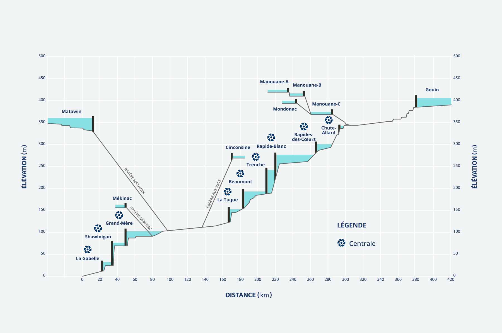

# Saint-Maurice — visualisation des débits Hydro-Québec

> [Voir la démo en direct](https://cg-247.github.io/saint-maurice/)

Animation interactive du **bassin Saint-Maurice** (Québec) :
débits, production électrique estimée et niveaux des réservoirs, à partir des données ouvertes
publiées par Hydro-Québec.

## Voir la démo

→ **https://cg-247.github.io/saint-maurice/**

L'animation s'ouvre sur la vue **Jour** la plus récente. La barre de contrôle en bas
permet de naviguer dans le temps :

- **Sélecteur de pas** — bascule entre **Heure** (~600 frames), **Jour** (~25 frames,
  heure de pointe de chaque jour) et **Semaine** (plage dim → sam, heure de pointe).
- **▶ Play / ⏸ Pause** — lecture automatique.
- **◀ ▶▶** — frame précédente / suivante.
- **⏮ Début / ⏭ Maintenant** — saut direct à la première ou dernière frame.
- **Slider** — position libre dans la fenêtre de temps.
- **Vitesse** — Lent / Normal / Rapide / Très rapide pour la lecture auto.
- **Clic sur le sparkline** d'une centrale — ouvre un graphique grand format
  avec curseur cliquable pour repositionner la frame.

## Faits saillants automatiques

Un **bandeau textuel** en bas à droite affiche un résumé de l'état de la
rivière pour la date sélectionnée (« Pleine crue printanière », « Plateau
élevé », « Décrue amorcée », etc.) avec le contexte de la fonte au nord et
des mouvements des réservoirs amont.

Ce résumé est **calculé automatiquement à partir des chiffres bruts**, par
règles métier (cascade de seuils + phrases pré-écrites). Pas de jargon, pas
de chiffres dans la prose — les chiffres sont déjà dans les étiquettes et
sparklines de l'animation. Le texte change avec la frame quand vous naviguez
dans le temps.

## Sources

### Image de fond

L'image de fond est le **schéma d'élévation du bassin Saint-Maurice** publié par
Hydro-Québec. Elle représente, en coupe, les ~280 km du bassin du nord (réservoir Gouin
à 400 m d'élévation) jusqu'au fleuve Saint-Laurent (centrale La Gabelle au niveau 0 m),
avec les neuf centrales (Chute-Allard, Rapides-des-Cœurs, Rapide-Blanc, Trenche, Beaumont,
La Tuque, Grand-Mère, Shawinigan, La Gabelle) et les principaux réservoirs amont
(Gouin, Manouane-A/B/C, Mondonac, Matawin, Mékinac, Cinconsine).

L'animation **superpose dynamiquement les mesures en temps quasi-réel** (débit, production
calculée, niveau, déversement) directement sur cette représentation géographique du bassin.

### Données

Les mesures proviennent de [**Hydro-Québec — Données ouvertes**](https://www.hydroquebec.com/documents-donnees/donnees-ouvertes/) :
fichiers JSON horaires des stations hydrométriques et hydrométéorologiques, mis à jour
quotidiennement. Licence des données : [Creative Commons BY 4.0](https://creativecommons.org/licenses/by/4.0/deed.fr).

### Différence avec l'outil officiel HQ

L'outil officiel d'Hydro-Québec [**Débits et niveaux d'eau**](https://www.hydroquebec.com/production/debits-niveaux-eau.html)
permet de consulter, **un site à la fois**, les graphiques 2D (temps × valeur) sur les
10 derniers jours, par sélection progressive (type de mesure → région → lieu).

Cette animation **fusionne** ces données pour offrir une **vue d'ensemble géographique
animée** du bassin entier : tous les sites en même temps, posés sur le schéma d'élévation,
avec lecture temporelle synchronisée. Permet de voir d'un coup d'œil **où l'eau se trouve
dans le bassin** à un instant donné, comment les pointes se propagent de l'amont vers
l'aval, et quels ouvrages déversent (eau perdue) à un moment donné.

## Méthodologie

- **Débit total / turbiné / déversé** : valeurs publiées directement par Hydro-Québec
  (mesures horaires, sommées sur les multiples turbines/déversoirs d'une même installation).
- **Niveau amont/aval** : station hydrométrique associée à chaque centrale.
- **Production électrique estimée** : `P (MW) = ρ · g · Q_turb · H · η / 10⁶`
  avec η = 0,90 (rendement turbine + génératrice).
- **Couleur** (statut de chaque centrale) : ratio `(débit_courant - min_historique) / (max - min)`
  — vert < 25 %, jaune 25-50 %, orange 50-75 %, rouge ≥ 75 %.
- **Pointe (vues Jour et Semaine)** : on retient l'horodatage où le débit total **bassin**
  est maximum sur la fenêtre, avec toutes les valeurs cohérentes de cet instant.
- **Heure** : convertie en heure locale Québec (HAE/HNE).

## Licences

- **Code** ([HTML/CSS/JS de l'animation](index.html)) : [MIT](LICENSE)
- **Données et image** : [CC BY 4.0](LICENSE-DATA.md) (Hydro-Québec)

## Mise à jour

Animation régénérée manuellement à partir des fichiers ouverts d'Hydro-Québec.
Instantané du 2026-05-01.

---

*Projet personnel non affilié à Hydro-Québec. Les données sont reproduites avec attribution
selon les conditions de la licence d'utilisation des données ouvertes.*