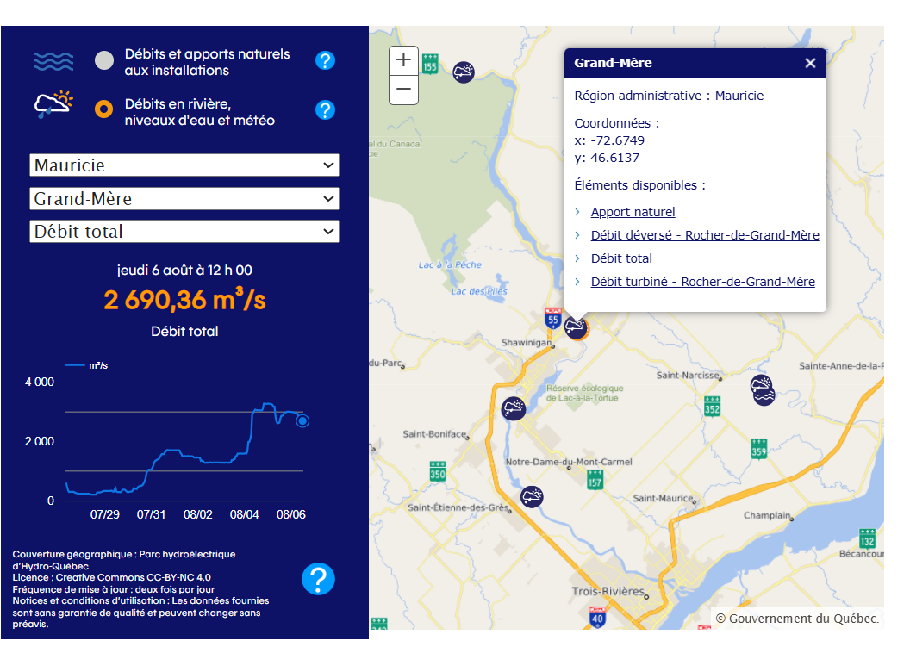
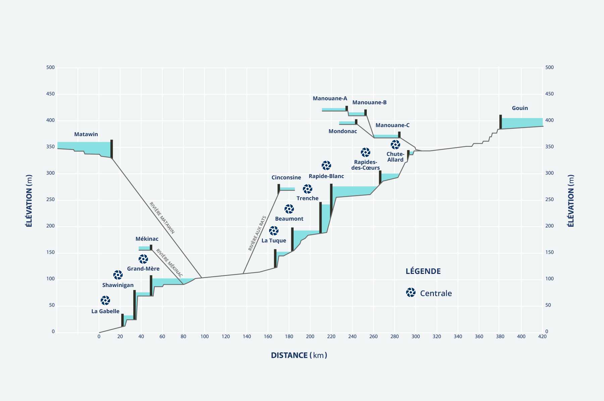
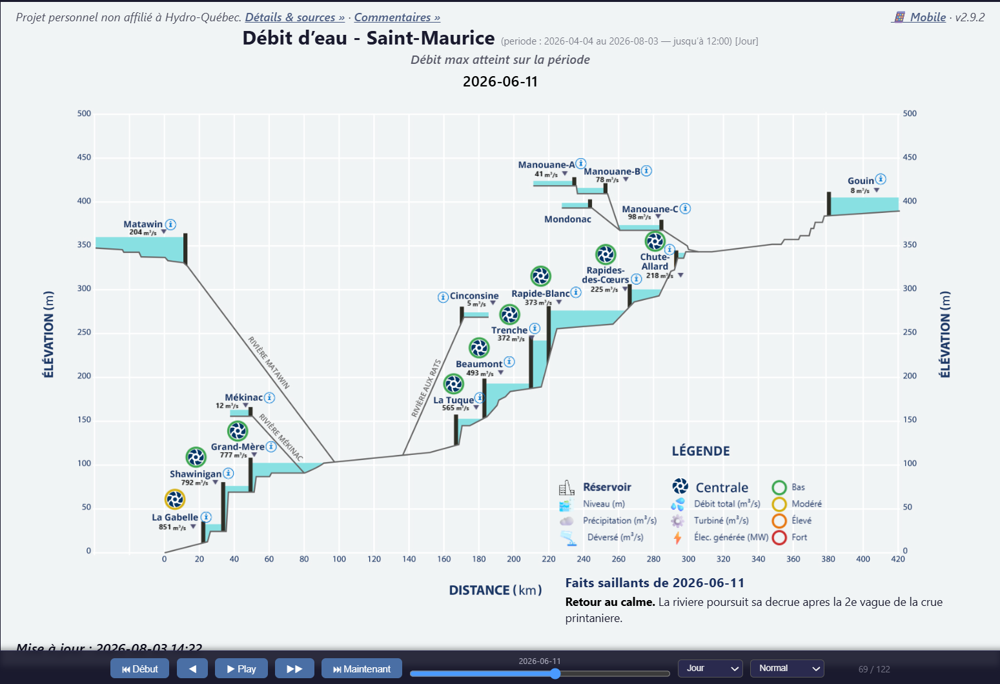
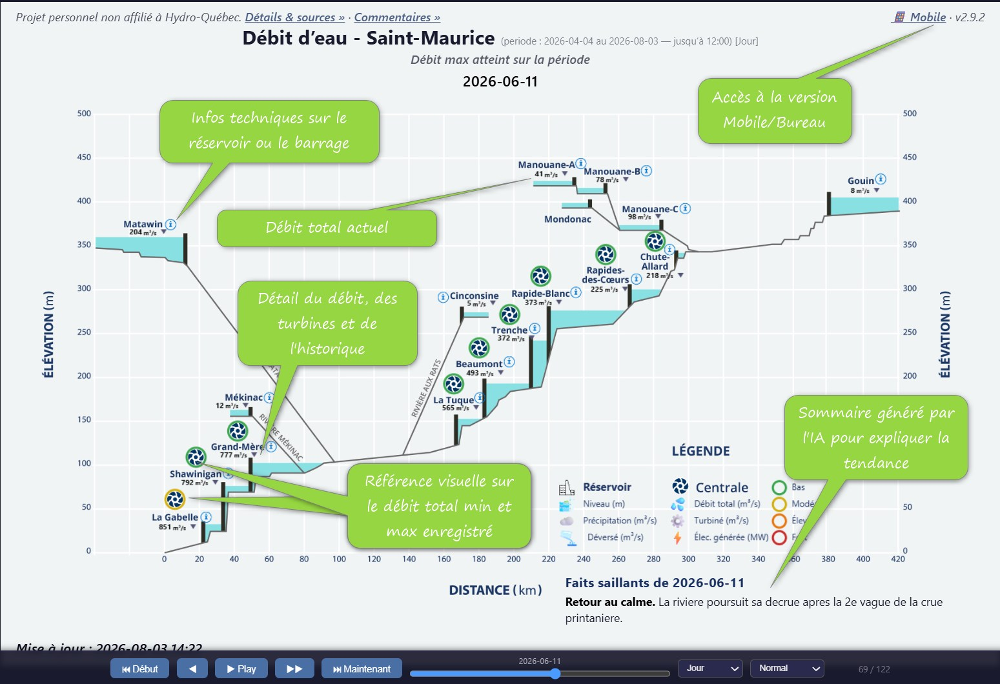
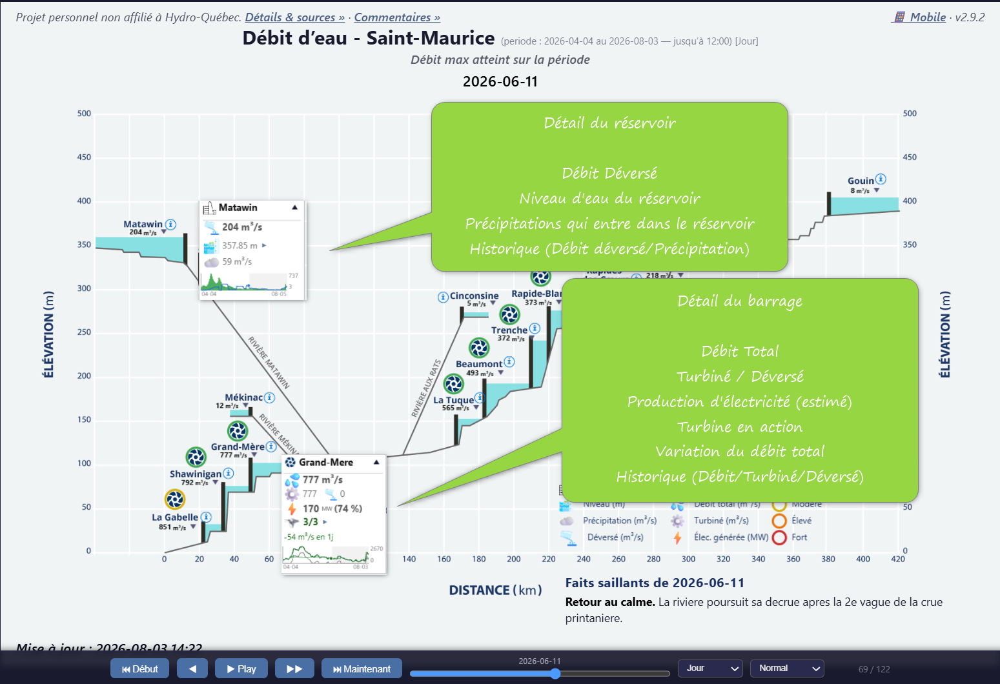
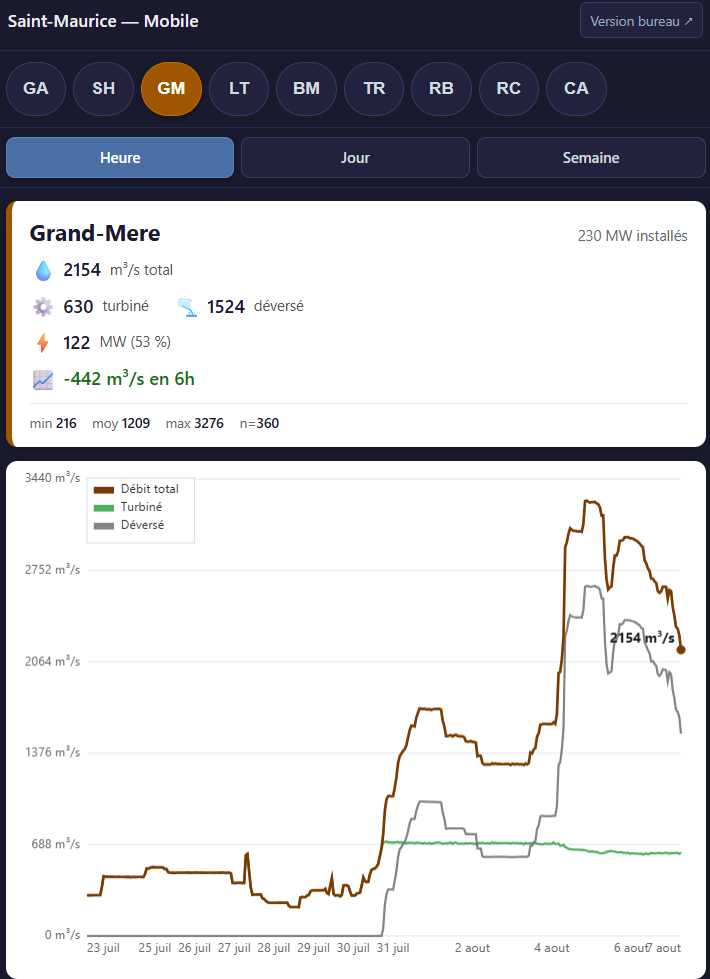

# Saint-Maurice — les débits d'eau, en un coup d'œil

Où est l'eau dans la rivière Saint-Maurice, en ce moment ? Combien chaque barrage
laisse-t-il passer ? Cette page anime les données publiques d'Hydro-Québec sur les
**neuf centrales et les sept réservoirs** du bassin, du réservoir Gouin jusqu'au
Saint-Laurent.

## Ouvrir l'animation

Il existe deux versions. **Le lien Bureau suffit dans la plupart des cas** : sur un
téléphone, il bascule tout seul vers la version mobile.

| Version | Lien |
|---|---|
| **Bureau** | [→ Ouvrir](https://cg-247.github.io/saint-maurice/index.html) (<https://cg-247.github.io/saint-maurice/index.html>) |
| **Mobile** | [→ Ouvrir](https://cg-247.github.io/saint-maurice/mobile.html) (<https://cg-247.github.io/saint-maurice/mobile.html>) |

Le lien **Mobile / Bureau**, en haut à droite de l'animation, permet de forcer l'une ou
l'autre à tout moment — le choix est retenu pour les visites suivantes.

---

## Au choix

| Je veux… | Section |
|---|---|
| Comprendre d'où vient ce projet et savoir m'en servir | [L'idée](#lidée) |
| L'installer sur mon téléphone | [Installer comme app](#installer-comme-app) |
| Savoir d'où viennent les chiffres | [Sources et méthode](#sources-et-méthode) |

---

## L'idée

### Le point de départ

Hydro-Québec publie ses mesures de débit dans un outil officiel,
[Débits et niveaux d'eau](https://www.hydroquebec.com/production/debits-niveaux-eau.html)
(<https://www.hydroquebec.com/production/debits-niveaux-eau.html>) :

Il est complet et fiable, mais il impose trois contraintes quand on veut suivre la
rivière dans son ensemble :

- **Un site à la fois.** Trois menus en cascade — région, puis lieu, puis type de
  mesure — et il faut tout recommencer pour le barrage suivant.
- **Un graphique 2D par site**, sans lien visuel avec la géographie du bassin.
- **Dix jours d'historique.** Au-delà, les données ne sont plus consultables.

Sur la capture ci-dessus, on voit bien la crue du 4 août à Grand-Mère — mais pour savoir
d'où elle vient et quand elle atteindra le barrage suivant, il faut ouvrir neuf pages,
les comparer de tête, et espérer que l'épisode tienne dans dix jours.

### Le déclic : une image d'Hydro-Québec

Hydro-Québec publie aussi un **schéma d'élévation** du bassin — une coupe qui montre
les 420 km de rivière, chaque barrage à sa hauteur réelle, du nord vers le sud :

Ce schéma dit exactement ce qu'on veut savoir : *où* est chaque ouvrage, et comment ils
s'enchaînent. Mais il est **figé** — que des noms, aucune mesure.

### Ce que fait ce projet

**Rendre ce schéma vivant.** Les mesures d'Hydro-Québec sont superposées sur l'image, à
leur place géographique, et rejouées heure par heure.

### En version Bureau

|  | Outil officiel HQ | Cette animation |
|---|---|---|
| Combien de sites | Un seul à la fois | **Les 9 centrales + les 7 réservoirs ensemble** |
| Forme | Graphique 2D | **Le bassin en coupe, à l'échelle** |
| Historique | 10 jours | **Depuis avril 2026, cumulatif** |
| Lecture | Statique | **Animée, heure par heure** |

Concrètement, on voit **la vague descendre** : un épisode de pluie fait monter les
réservoirs du nord, puis la pointe se propage de barrage en barrage vers le sud. Le
délai entre les deux extrémités se lit directement sur l'écran.

Chaque ouvrage porte alors ses mesures du moment :

La rosace autour de chaque centrale situe son débit actuel par rapport à tout son
historique : 🟢 Bas · 🟡 Modéré · 🟠 Élevé · 🔴 Fort

### Le détail d'un ouvrage

Un clic sur une étiquette agrandit l'ouvrage et ouvre sa fiche — le contenu diffère
selon qu'il s'agit d'un réservoir ou d'un barrage :

Le graphique de la fiche est interactif : **bouger son curseur déplace toute l'animation**
à l'instant choisi. Sur ordinateur, l'indicateur de turbines donne le type (Francis ou
Kaplan) et le nombre de groupes en fonction ; un clic ouvre le régime estimé de chacun.

### Naviguer dans le temps

Tout se passe dans la barre du bas :

- **Play** — lance l'animation.
- **Slider** — se déplacer librement dans le temps.
- **Sélecteur Heure / Jour / Semaine / Mois** — change le pas de temps. « Heure » pour
  suivre une crue en détail, « Mois » pour la vue d'ensemble.
- **Maintenant** — revient à la mesure la plus récente.

### En version Mobile

L'outil officiel d'Hydro-Québec s'affiche correctement sur un téléphone, mais il reste
piloté par **menus déroulants** : dérouler, faire défiler la liste, choisir — et tout
recommencer pour la centrale suivante.

Ici, **les neuf centrales sont là en permanence**, en haut de l'écran. Un seul appui
suffit pour passer de l'une à l'autre — de Grand-Mère à La Tuque, aller-retour, sans
jamais rouvrir un menu.

C'est la vue terrain : les débits tout de suite, avec le graphique des dernières
semaines juste en dessous. Sur un petit écran, y ajouter les réservoirs rendrait
l'ensemble illisible — cette analyse-là reste sur grand écran.

| | Outil HQ sur mobile | Cette version |
|---|---|---|
| Changer de centrale | 3 menus déroulants, à refaire chaque fois | **Un appui sur la pastille** |
| Ce qu'on voit | Un site à la fois | **Les 9 centrales toujours accessibles** |
| Hors ligne | Non | **Oui, une fois installée** |

---

## Installer comme app

L'animation s'ajoute à l'écran d'accueil du téléphone ou au menu de l'ordinateur, et
s'ouvre alors comme une vraie application, sans barre d'adresse.

La même adresse sert dans les deux cas — l'app installée affiche automatiquement la
version qui convient à l'appareil.

<b>Android</b> (Chrome, Edge, Samsung Internet, Brave)

1. Ouvrir <https://cg-247.github.io/saint-maurice/index.html> dans Chrome.
2. Une bannière « Ajouter à l'écran d'accueil » apparaît en bas. Sinon :
   menu **⋮ → Installer l'application**.
3. L'icône apparaît sur l'écran d'accueil.

<b>iPhone / iPad</b> (Safari uniquement)

1. Ouvrir <https://cg-247.github.io/saint-maurice/index.html> dans **Safari**
   (Chrome iOS ne supporte pas l'installation).
2. Toucher le bouton **Partager** (carré avec flèche vers le haut).
3. Choisir **« Ajouter à l'écran d'accueil »**.

<b>Ordinateur</b> (Windows, macOS, Linux)

1. Ouvrir <https://cg-247.github.io/saint-maurice/index.html> dans Chrome, Edge ou Brave.
2. Cliquer l'**icône d'installation** (un écran avec une flèche vers le bas), à droite
   de la barre d'adresse.
3. L'app rejoint le menu Démarrer (Windows), le Launchpad (macOS) ou le menu
   d'applications (Linux).

<b>Désinstaller</b>

- **Mobile** : appui long sur l'icône → Désinstaller (Android) ou Supprimer l'app (iOS).
- **Ordinateur** : ouvrir l'app, menu ⋮ en haut à droite → Désinstaller.

---

## Sources et méthode

<b>D'où viennent les données</b>

Les mesures proviennent de
[**Hydro-Québec — Données ouvertes**](https://www.hydroquebec.com/documents-donnees/donnees-ouvertes/)
(<https://www.hydroquebec.com/documents-donnees/donnees-ouvertes/>) :
fichiers JSON horaires des stations hydrométriques et hydrométéorologiques, mis à jour
quotidiennement. Licence : [Creative Commons BY 4.0](https://creativecommons.org/licenses/by/4.0/deed.fr)
(<https://creativecommons.org/licenses/by/4.0/deed.fr>).

Les fiches techniques des barrages viennent du
[**Répertoire des barrages du CEHQ**](https://www.cehq.gouv.qc.ca/barrages/default.asp)
(<https://www.cehq.gouv.qc.ca/barrages/default.asp>)
(Centre d'expertise hydrique du Québec, MELCCFP), publiées dans le cadre du programme de
suivi de la sécurité des barrages au Québec.

L'image de fond est le **schéma d'élévation du bassin** publié par Hydro-Québec : les
420 km du bassin en coupe, du réservoir Gouin (400 m) au Saint-Laurent (La Gabelle, 0 m).

Les **neuf centrales** suivies, du nord au sud : Chute-Allard, Rapides-des-Cœurs,
Rapide-Blanc, Trenche, Beaumont, La Tuque, Grand-Mère, Shawinigan, La Gabelle.
Les **sept réservoirs** : Gouin, Manouane-A, Manouane-B, Manouane-C, Matawin, Mékinac,
Cinconsine. *(Mondonac apparaît sur le schéma d'Hydro-Québec, mais aucune mesure n'est
publiée pour ce réservoir — il n'est donc pas animé.)*

<b>Ce qui est mesuré et ce qui est calculé</b>

**Mesuré** — publié directement par Hydro-Québec :

- Débit total, turbiné et déversé (mesures horaires, sommées quand une installation a
  plusieurs turbines ou déversoirs).
- Niveaux amont et aval, à la station hydrométrique de chaque centrale.

**Calculé** — reconstruit à partir des mesures :

- **Production électrique** : `P (MW) = ρ · g · Q_turb · H · η / 10⁶`, avec η = 0,90
  (rendement turbine + génératrice).
- **Couleur de l'anneau** : ratio `(débit − min historique) / (max − min)` — vert < 40 %,
  jaune 40-65 %, orange 65-85 %, rouge ≥ 85 %. Les seuils ne sont pas des quartiles
  égaux : ils sont décalés vers le haut pour que le rouge signale un débit réellement
  inhabituel (haut 15 % de l'amplitude historique) plutôt qu'une exploitation courante.

**Estimé** — une reconstruction plausible, pas une mesure. Hydro-Québec publie le débit
turbiné *total* d'une centrale, jamais le détail par groupe. À partir de ce total, du type
de turbine (Francis ou Kaplan/Saxo) et du nombre de groupes, l'animation propose une
configuration :

- **Groupes en service** : le moins possible, pour que chacun travaille dans sa zone de
  bon rendement (~85 % du régime nominal). Sous un plancher technique (≈ 50 % pour les
  Francis, ≈ 25 % pour les Kaplan), un groupe est arrêté plutôt que de tourner à bas
  régime (vibrations, cavitation, usure).
- **Répartition** : également entre les groupes en service.
- **Surcharge** : un groupe peut dépasser 100 % du nominal (réserve de +5 à +15 %),
  typiquement en crue pour turbiner le maximum avant de devoir déverser. Affiché en orange.

<b>Comment les vues Jour, Semaine et Mois sont agrégées</b>

Règle unique : **le pic propre à chaque centrale**. On repère l'heure où le débit total
de la centrale atteint son maximum dans la période, puis on lit *toutes* ses autres
séries (turbiné, déversé, niveaux, production) **à cette heure précise**.

La chute `H = amont − aval` et la production sont donc calculées au même instant que le
pic de débit — ce qui garantit leur cohérence physique.

Les niveaux de réservoir font exception : ils sont moyennés, car ce sont des variables
lentes dont le pic instantané n'apprend rien. Les apports, publiés en agrégat journalier,
retiennent le maximum de la période.

En vue **Jour**, un label comme « 2026-05-16 — jusqu'à 14:00 » signale une journée encore
incomplète. Sans suffixe, la journée est entière.

<b>Licences</b>

- **Code** ([HTML/CSS/JS de l'animation](index.html)) : [MIT](LICENSE)
- **Données et image de fond** : [CC BY 4.0](LICENSE-DATA.md) (Hydro-Québec)

---

*Projet personnel non affilié à Hydro-Québec. Les données sont reproduites avec
attribution, selon les conditions de la licence d'utilisation des données ouvertes.*
